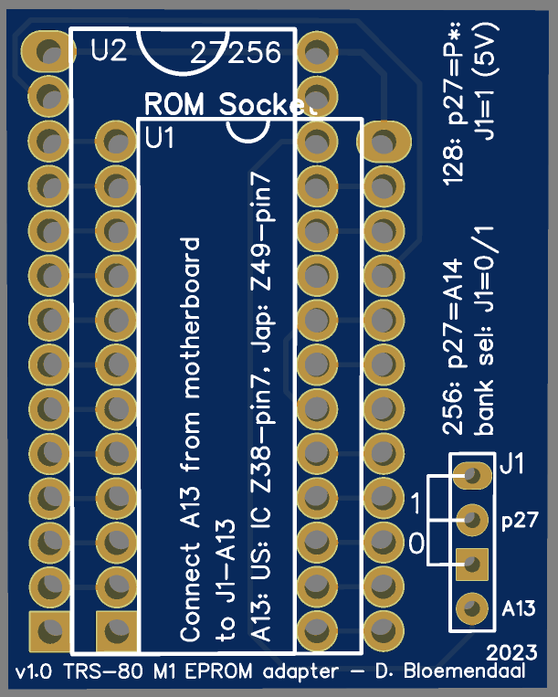
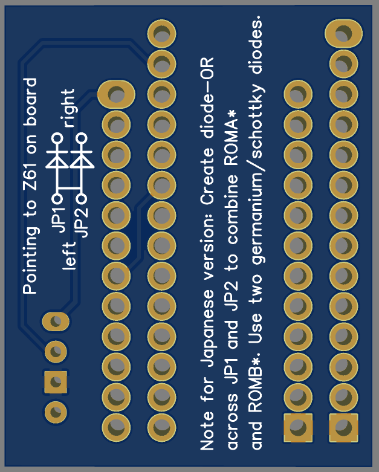
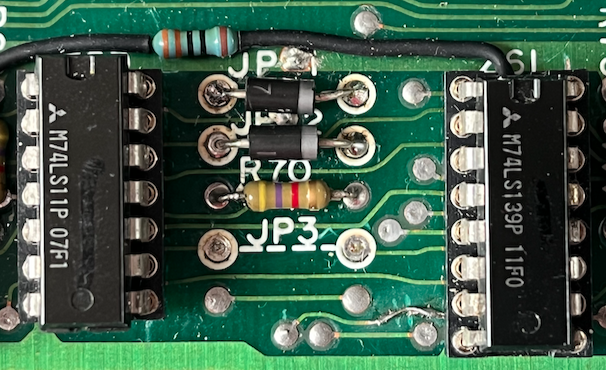
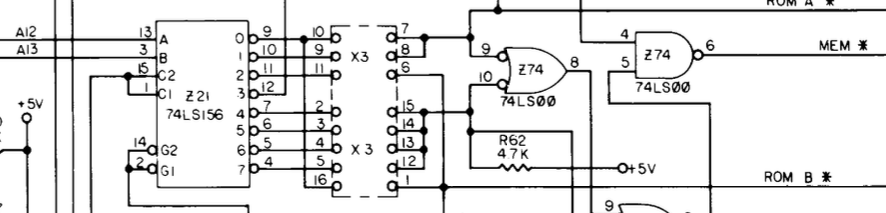
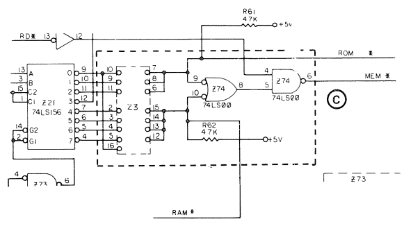
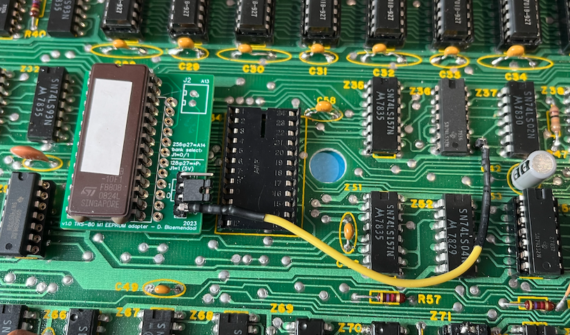
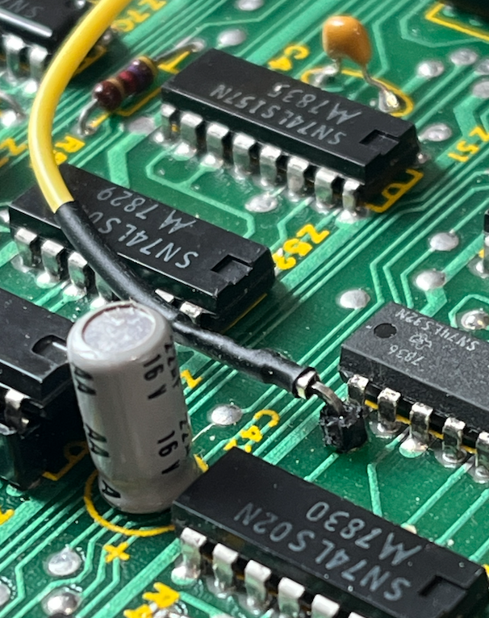

# EPROM module for TRS-80 Model 1 ROM replacement

This module is based on [this article](https://www.trs-80.com/wordpress/repairs/using-an-eprom/). 
This version supports both 27128 and 27256 EPROMs. When using the 256 you kan switch banks by setting a jumper (J1). That way you can put two rom images in your EPROM. It switches A14 to 0 or to 1. When using the 27128 you need to set J1 to 1 (connect to 5V).

It is recommended to follow the same instructions for assembly as described in the above link using machined pins.

The module can be used for both the US version as the Japanese version. 

# Japanese board

For the Japanese version you need to place two (
germanium/schottky) diodes (diode OR-gate) over JP1 and JP2. Both diodes need to point to Z61 on the board (to the
right) and should be connected on the left side. Underside of the PCB describes this as well.

In this case the left sides of the diodes are connected on the backside of the board.

# US board
There are different versions of the US boards around. My version has pin 16 on X3 connected to pin 1 directly connected to ROMB*:

On my board all jumpers on x3 are connected. 
Some boards have a different configuration:

In that case you may have to follow [these instructions](https://www.buessert.de/Technik/Museum/TRS-80/M1/ROM/english.htm) to make sure ROMA* and ROMB* are properly configured.

Installed in the US model I (using an earlier version of this board:

Extracting A13 from the US board using the via near Z37:

